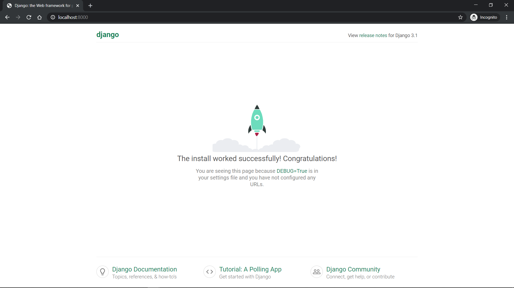
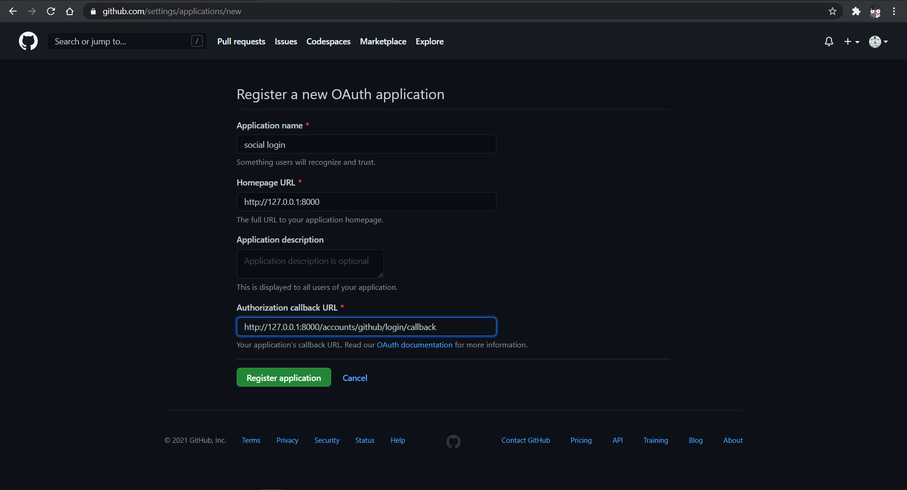
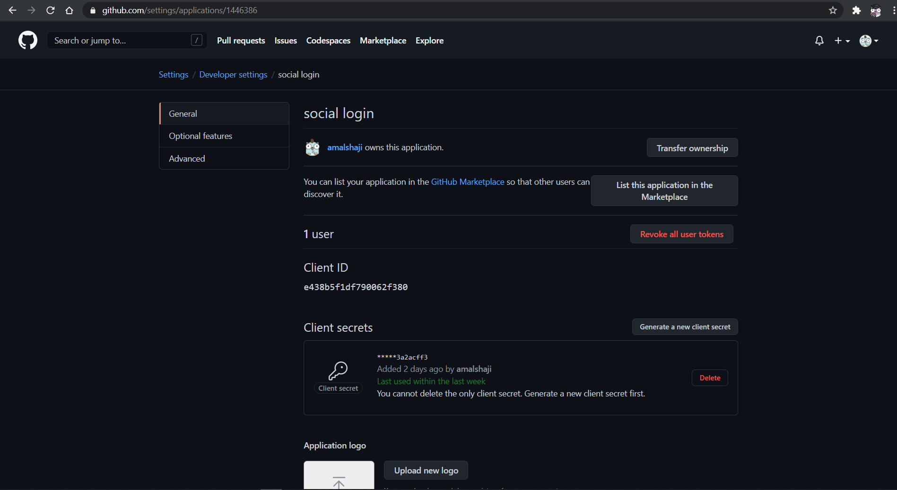
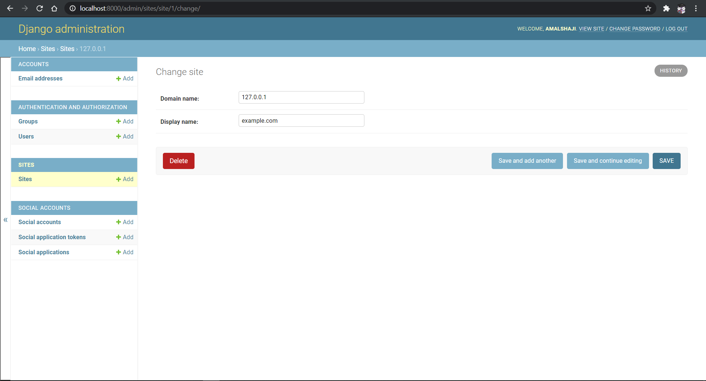
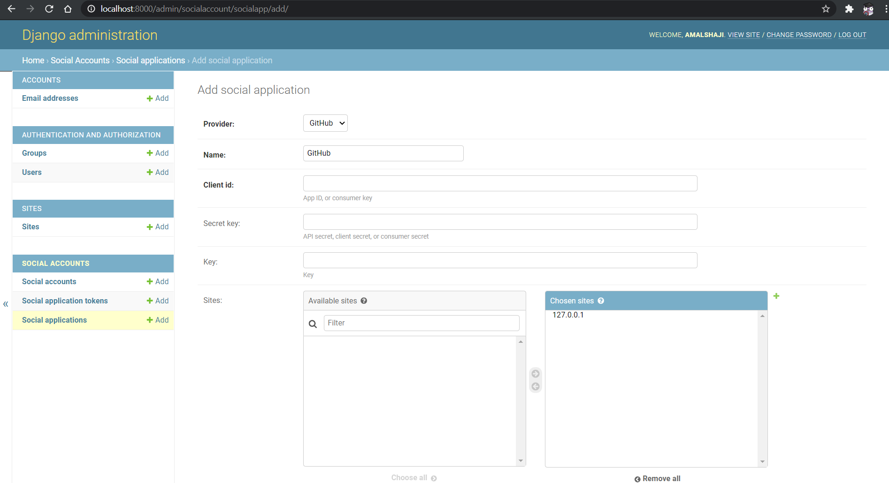
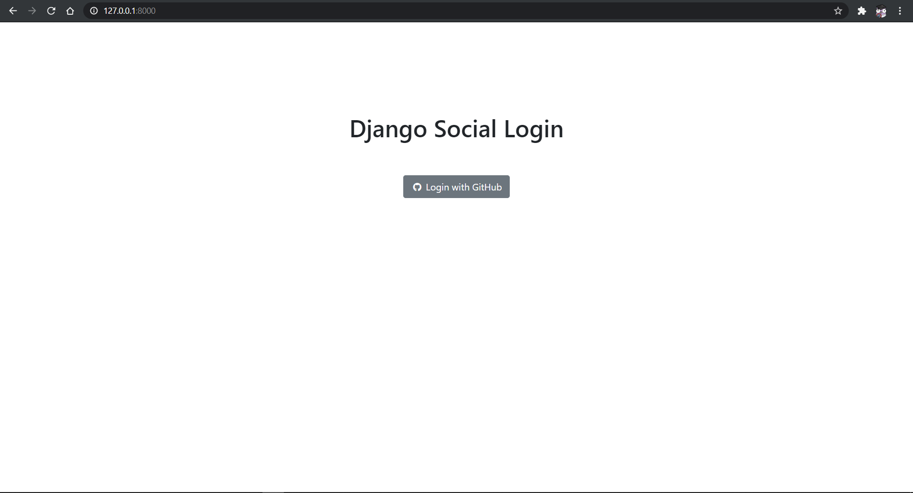
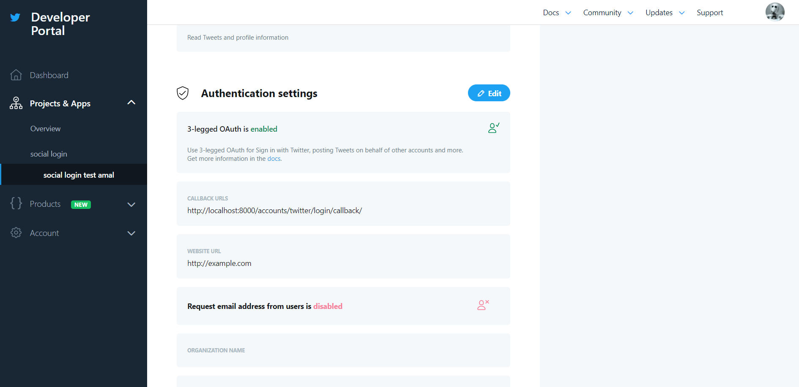
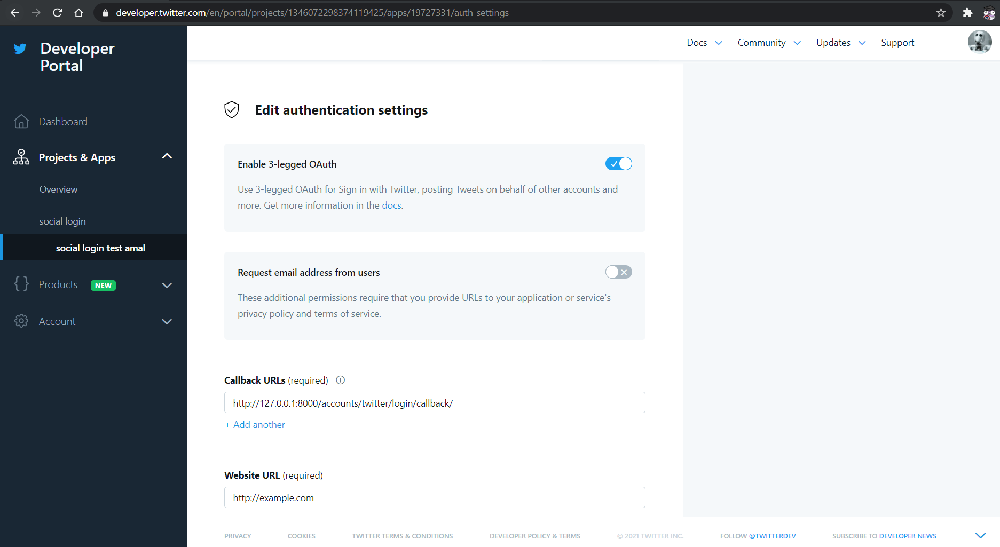
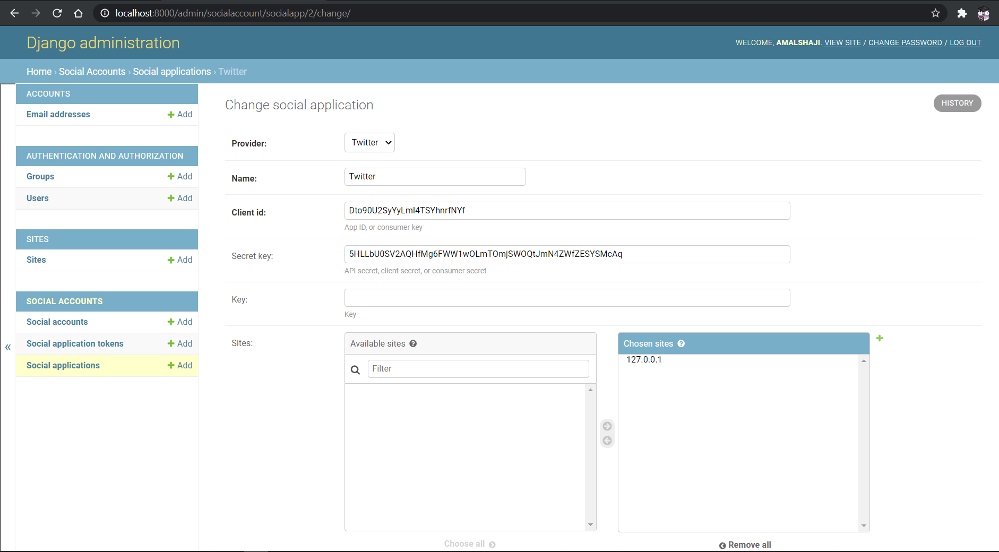

# Adding Social Authentication to Django

This post looks at how to add [social login](https://en.wikipedia.org/wiki/Social_login) to a Django application.

> Social login is a form of single sign-on using existing information from a social networking service such as Facebook, Twitter or Google, to sign in to a third-party website instead of creating a new login account specifically for that website. It is designed to simplify logins for end-users and provide more reliable demographic information to web developers. - Wikipedia

Using a social login has its advantages. The developer need not setup login/signup for the web application, as the third-party websites provide the authentication. Also, services like Google, Facebook, GitHub does extensive checks to prevent unauthorized access to their services. This can boost the security of our application.

## Django Allauth v/s Python Social Auth

[Django allauth](https://github.com/pennersr/django-allauth) and [Python social auth](https://python-social-auth.readthedocs.io/en/latest/) are the two most popular libraries for implementing social authentication in Django.

### Django Allauth

#### Pros

- Django Allauth is a trendy library
- It supports over 50 authentication providers
- Along with social login, it also provides login with email and username
- Django allauth supports providing custom forms during signups

#### Cons

- Though the library is popular, the documentation is not well written
- Initial setup required to register an OAuth application. This could be a slight overhead for beginners.
- 250+ issues on GitHub

### Python Social Auth

#### Pros

- Provides support for frameworks such as Django, Flask, Webpy, Pyramid, and Tornado.
- It supports almost 50 OAuth providers
- Support for Django ORM and MongoEngine
- It provides a Storage interface to allow users to add more databases.

#### Cons

- This library also lacks a well-written documentation
- Close to 100 open issues on GitHub

Both libraries have their ups and downs. However, this post focuses on Django Allauth as it is more popular.

## Django Setup

### Create a new Django project

Let's create a new Django app; start by creating and virtualenv and installing Django.

```bash
$ virtualenv .venv

$ .venv/Scripts/activate # for windows
$ source venv/scripts/activate # for linux

# install django
(.venv) $ pip install Django==3.1.4
```

Now create a new project,

```bash
(.venv) $ django-admin startproject social_app
(.venv) $ cd social_app

# create the initial migration
(.venv) $ python manage.py migrate

# Run the server
(.venv) $ python manage.py runserver
```

Navigate to http://localhost:8000, and you should see the following screen,



### Configure Django Allauth

Now let's set up Django allauth for our Django app. Start by installing Django allauth

```bash
(.venv) $ pip install django-allauth==0.44.0
```

For django-allauth to work with our django app, we must update the `settings.py` file.

```python
# social_login/settings.py

INSTALLED_APPS = [
    "django.contrib.admin",
    "django.contrib.auth",
    "django.contrib.contenttypes",
    "django.contrib.sessions",
    "django.contrib.messages",
    "django.contrib.staticfiles",
    "django.contrib.sites",  # new
    # 3rd party
    "allauth", # new
    "allauth.account", # new
    "allauth.socialaccount", # new
    # We use the following providers
    "allauth.socialaccount.providers.github", # new
    "allauth.socialaccount.providers.twitter", # new
]
```

`Django.contrib.sites` is required to add a domain to our Django application. Read more about it in the [django sites framework documentation](https://docs.djangoproject.com/en/3.1/ref/contrib/sites/)

Now add the following to `settings.py`

```python
# social_login/settings.py

AUTHENTICATION_BACKENDS = (
    "django.contrib.auth.backends.ModelBackend",
    "allauth.account.auth_backends.AuthenticationBackend",
)

SITE_ID = 1
ACCOUNT_EMAIL_VERIFICATION = "none"
LOGIN_REDIRECT_URL = "home"
ACCOUNT_LOGOUT_ON_GET = True
```

Here, we defined the following,

- Authentication backends (django + django-allauth)
- `SITE_ID`: This is required for django-allauth to function.
- Turn off verification email
- Redirect to `home` after login
- Disable the confirmation page during log out; this will directly log out the user without asking for confirmation.

Now we update the `urls.py` to include allauth.

```python
# social_login/urls.py

from django.contrib import admin
from django.urls import path, include # new
urlpatterns = [
    path("admin/", admin.site.urls),
    path("accounts/", include("allauth.urls")), # new
    path("accounts/", include("django.contrib.auth.urls")), # new
]
```

Migrate the changes to update the database,

```bash

(.venv) $ python manage.py migrate

(.venv) $ python manage.py runserver
```

## GitHub example

Now that both the Django project and allauth are ready, we'll add a GitHub login to our application. First, we need to create an OAuth app and get the OAuth keys from GitHub.

Head over to https://github.com/settings/applications/new, and create a new OAuth application.



```text
Homepage URL: http://127.0.0.1:8000
Callback URL: http://127.0.0.1:8000/accounts/github/login/callback
```

Once you create a new application, you'll get a Client ID and Client Secret, which must be kept secret.



Now we set up GitHub login on our Django admin panel. Before proceeding any further, we need to create a superuser.

```bash

(.venv) $ python manage.py createsuperuser
```

Follow the steps and create a new superuser. Now run the server,

```bash
(.venv) $ python manage.py runserver
```

and login to http://localhost:8000/admin

Navigate to http://localhost:8000/admin/sites/site/, and change the `domain name` to `127.0.0.1`



> The OAuth does not accept `localhost` while registering a new application. So we use `127.0.0.1` instead. Replace the `127.0.0.1` with your actual URL on production.

Now go back to the homepage of admin, and goto `Social applications`. Click `ADD SOCIAL APPLICATION`.



Do the following

- Choose GitHub as Provider
- Add Client ID and Client Secret obtained earlier
- Choose 127.0.0.1 (either using the arrows or using choose all)

We have successfully integrated GitHub with our django app. Now let's create a view to test it out.

### Templates

Create a new folder named templates, and two files named `base.htm` and `home.htm`.

```bash
(.venv) $ mkdir templates && cd templates
(.venv) $ touch base.htm home.htm
```

Setup our template directory in settings.py. We tell the Django app to look for the `templates` directory in the BASE DIRECTORY.

```python
# social_login/settings.py

TEMPLATES = [
    {
        ...
        "DIRS": [str(BASE_DIR.joinpath("templates"))],
        ...
    },
]
```

Add the following to `templates/base.htm`.

```html
<!DOCTYPE html>
<html lang="en">
  <head>
    <meta charset="UTF-8" />
    <link
      href="https://cdn.jsdelivr.net/npm/bootstrap@5.0.0-beta1/dist/css/bootstrap.min.css"
      rel="stylesheet"
    />
    <link
      rel="stylesheet"
      href="https://stackpath.bootstrapcdn.com/font-awesome/4.7.0/css/font-awesome.min.css"
    />
    <meta name="viewport" content="width=device-width, initial-scale=1.0" />
    <title>Django Social Login</title>
  </head>
  <body>
     
    <script src="https://cdn.jsdelivr.net/npm/@popperjs/core@2.5.4/dist/umd/popper.min.js"></script>
    <script src="https://cdn.jsdelivr.net/npm/bootstrap@5.0.0-beta1/dist/js/bootstrap.min.js"></script>
  </body>
</html>
```

This calls the bootstrap library and another library to include some icons.

Now we populate `templates/home.htm` with the following,

```html
  
<div class="container" style="text-align: center; padding-top: 10%;">
  <h1>Django Social Login</h1>
  <br /><br />
  
  <h3>Welcome {{ user.username }} !!!</h3>
  <br /><br />
  <a href="" class="btn btn-danger">Logout</a>
  
  <a href="" class="btn btn-secondary"
    ><i class="fa fa-github fa-fw"></i> Login with GitHub</a
  >
  
</div>

```

`home.htm` contains the login button and logout button. Finally, we need to create a view to serve `home.htm`.

```python
social_login/views.py

from django.views.generic import TemplateView


class Home(TemplateView):
    template_name = "home.htm"
```

and include it in `urls.py`

```python
# social_login/urls.py

from django.contrib import admin
from django.urls import path, include
from .views import Home # new

urlpatterns = [
    path("admin/", admin.site.urls),
    path("accounts/", include("allauth.urls")),
    path("accounts/", include("django.contrib.auth.urls")),
    path("", Home.as_view(), name="home"), # new
]
```

Navigate to http://127.0.0.1:8000, and you should see,



## Twitter Example

Setting up a Twitter login is similar to the GitHub example.

1. Grab tokens by creating an OAuth application
1. Register the app in django-admin
1. Add URL to the home template

To get tokens, you'll need to set up a [Twitter developer](https://developer.twitter.com/en/portal/dashboard) account. Once created, go to [Projects and Apps](https://developer.twitter.com/en/portal/projects-and-apps) tab and click on `Create App`.



Once the app is created, go to the app and select `Authentication Settings`. Enable it, and add the following,



Now, navigate to the `keys and token` tab on the top of the page. There you can access your tokens under `API key & secret`.

Next, we need to register our app with django-admin. Navigate to http://localhost:8000/admin/socialaccount/socialapp/ and add a new Twitter app.



> Remember to safeguard your API keys and tokens.

All we need to do now is to add a button that says `Login with Twitter`. Make the following change to `templates/home.htm`.

```html

<a href="" class="btn btn-secondary"
  ><i class="fa fa-github fa-fw"></i> Login with GitHub</a
>
// new
<a href="" class="btn btn-primary"
  ><i class="fa fa-twitter fa-fw"></i> Login with Twitter</a
>

```

Go to http://127.0.0.1:8000 and test out your application.

### Demo


## Conclusion

In this post, we saw how to set up Twitter and GitHub login for our Django application. Setting up social login is not a tough job; we performed the following Twitter and GitHub steps.

1. Grab API tokens by creating OAuth tokens
1. Register OAuth application with Django-admin
1. Add URL to templates

Though the post was focused on Django allauth, it does not necessarily mean Django allauth is the best. Explore both libraries, try out methods like implementing custom forms, and linking multiple social accounts. Finally, choose the one that fits your need.
