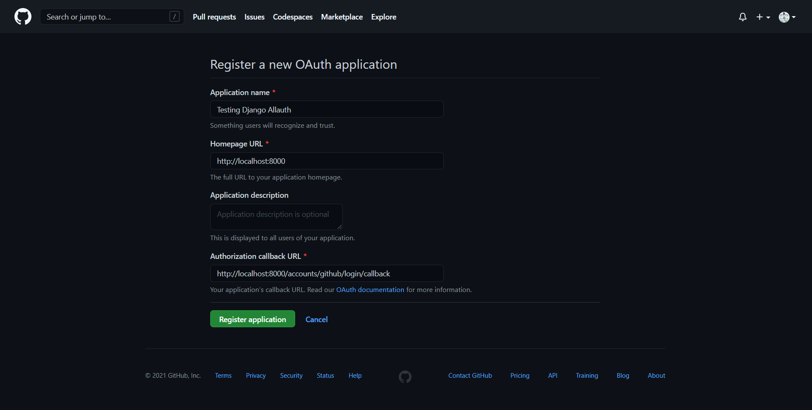

# Adding Social Authentication to Django

This post looks at how to add social auth (also known as social login or social sign-on) to a Django application with [Django Allauth](https://github.com/pennersr/django-allauth). You'll also configure GitHub and Twitter auth.

> Social login is a form of single sign-on using existing information from a social networking service such as Facebook, Twitter or Google, to sign in to a third-party website instead of creating a new login account specifically for that website. It is designed to simplify logins for end-users and provide more reliable demographic information to web developers. - [Wikipedia](https://en.wikipedia.org/wiki/Social_login)

Using a social auth has its advantages. The developer need not set up auth/signup for the web application, as the third-party websites provide the authentication. Also, since services like Google, Facebook, and GitHub do extensive checks to prevent unauthorized access to their services, leveraging social auth instead of rolling your own auth mechanism can boost your application's security.

## Why OAuth?

Pros:

- Improved security.
- Easier and faster log-in flows since there's no need to create and remember a username or password.
- In case of a security breach, no third-party damage will occur, as the authentication is passwordless.

Cons:

- Your application now depends on another app outside of your control. If the OpenID system is down, users won't be able to log in.
- People often tend to ignore the permissions requested by OAuth applications.
- Users that don't have accounts on the OpenID providers that you have configured won't be able to access your application. The best approach is to implement both -- e.g., username and password and OpenID -- and let the user choose.

## Django Allauth vs. Python Social Auth

[Django Allauth](https://github.com/pennersr/django-allauth) and [Python Social Auth](https://python-social-auth.readthedocs.io/en/latest/) are the two most popular packages for implementing social authentication in Django.

### Django Allauth

#### Pros

- Django Allauth is one of the most popular Django packages
- Supports over 50 authentication providers (i.e., GitHub, Twitter, Google)
- Along with social auth, it also provides regular auth with username and password
- Django Allauth makes it easy to customize the forms used during the auth flow

#### Cons

- Despite the package's popularity, the documentation is poorly structured and not meant for beginners.
- Initial setup required to register an OAuth application. This could be a slight overhead for beginners.
- 250+ issues on GitHub

### Python Social Auth

#### Pros

- Provides support for several Python web frameworks like Django, Flask, Webpy, Pyramid, and Tornado.
- Supports almost 50 OAuth providers
- Supports the Django ORM and [MongoEngine](http://mongoengine.org/) ODM
- It provides a Storage interface to allow users to add more ORMs. 
  See how the storage interface is used to create SQLAlchemy ORM [here](https://github.com/python-social-auth/social-storage-sqlalchemy/blob/master/social_sqlalchemy/storage.py). Read more about storage interface at the [official documentation](https://python-social-auth.readthedocs.io/en/latest/storage.html#storage-interface).

#### Cons

- The documentation is a bit simpler, but it could still use some work with regard to the organization
- Initial setup required to register an OAuth application. This could be a slight overhead for beginners.
- Close to 100 open issues on GitHub

Both packages have their ups and downs. However, this post focuses on Django Allauth as it's more popular and supports social auth and regular auth via username and password.

## Django Setup

### Create a new Django project

Let's create a new Django app.

Start by creating a virtual environment and installing Django:

```bash
$ mkdir django-social-auth && cd django-social-auth
$ python3.9 -m venv .venv
$ source .venv/bin/activate
(.venv)$ pip install Django==3.1.5
```

> Feel free to swap out virtualenv and Pip for [Poetry](https://python-poetry.org/) or [Pipenv](https://pipenv.pypa.io/). For more, review [Modern Python Environments](/blog/python-environments/).

Now create a new project, apply the migrations, and run the server:

```bash
(.venv)$ django-admin startproject social_app .
(.venv)$ python manage.py migrate
(.venv)$ python manage.py runserver
```

Navigate to [http://localhost:8000](http://localhost:8000). You should see the following screen:


### Configure Django Allauth

Next, let's set up Django Allauth for our Django app.

```bash
(.venv)$ pip install django-allauth==0.44.0
```

For Django Allauth to work with our django app, update `INSTALLED_APPS` inside the *settings.py* file like so:

```python
# social_app/settings.py

INSTALLED_APPS = [
    "django.contrib.admin",
    "django.contrib.auth",
    "django.contrib.contenttypes",
    "django.contrib.sessions",
    "django.contrib.messages",
    "django.contrib.staticfiles",
    "django.contrib.sites",  # new
    # 3rd party
    "allauth", # new
    "allauth.account", # new
    "allauth.socialaccount", # new
    # social providers
    "allauth.socialaccount.providers.github", # new
    "allauth.socialaccount.providers.twitter", # new
]
```

> settings.py (Important - Please note ‘django.contrib.sites’ is required as INSTALLED_APPS) - Django allauth documentation

Read more about it in the [django sites framework documentation](https://docs.djangoproject.com/en/3.1/ref/contrib/sites/).

`allauth`, `allauth.account`, and `allauth.socialaccount` are core apps required to setup OAuth. 

Now add the following to the bottom of *settings.py*:

```python
# social_app/settings.py

AUTHENTICATION_BACKENDS = (
    "allauth.account.auth_backends.AuthenticationBackend",
)

SITE_ID = 1
ACCOUNT_EMAIL_VERIFICATION = "none"
LOGIN_REDIRECT_URL = "home"
ACCOUNT_LOGOUT_ON_GET = True
```

Here, we defined the following:

- We added `allauth` as the authentication backend. All our logins(OAuth and via forms), as well as logouts, will be handled by allauth
- `SITE_ID`, which is required for Django Allauth to function.
- `ACCOUNT_EMAIL_VERIFICATION = "none"` to turn off verification emails. Django automatically sets up an email verification workflow. We do not need this functionality right now.
- `LOGIN_REDIRECT_URL = "home"` redirects the user to "home" after successful login
- `ACCOUNT_LOGOUT_ON_GET = True` directly logs out the user when `logout` button is clicked. This skips the `confirm logout` page.


Update the *urls.py* to include Django Allauth:

```python
from django.contrib import admin
from django.urls import path, include # new


urlpatterns = [
    path("admin/", admin.site.urls),
    path("accounts/", include("allauth.urls")), # new
]
```

Apply the migration files associated with Django Allauth:

```bash
(.venv)$ python manage.py migrate
```

Create a superuser:

```bash
(.venv)$ python manage.py createsuperuser
```

> Migrations are important here. Without them, the database tables won't be prepared, and the application runs into error.

### Templates

Create a new folder called "templates", and add two files to it called *_base.html* and *home.html*:

```bash
(.venv)$ mkdir templates && cd templates
(.venv)$ touch base.html home.html
```

Update `TEMPLATES` in *settings* so that Django knows where to find the templates:

```python
# social_app/settings.py

TEMPLATES = [
    {
        ...
        "DIRS": [str(BASE_DIR.joinpath("templates"))],
        ...
    },
]
```

*templates/_base.html*:

```html
<!DOCTYPE html>
<html lang="en">
  <head>
    <meta charset="UTF-8" />
    <link
      href="https://cdn.jsdelivr.net/npm/bootstrap@5.0.0-beta1/dist/css/bootstrap.min.css"
      rel="stylesheet"
    />
    <link
      rel="stylesheet"
      href="https://stackpath.bootstrapcdn.com/font-awesome/4.7.0/css/font-awesome.min.css"
    />
    <meta name="viewport" content="width=device-width, initial-scale=1.0" />
    <title>Django Social Login</title>
  </head>
  <body>
     
    <script src="https://cdn.jsdelivr.net/npm/@popperjs/core@2.5.4/dist/umd/popper.min.js"></script>
    <script src="https://cdn.jsdelivr.net/npm/bootstrap@5.0.0-beta1/dist/js/bootstrap.min.js"></script>
  </body>
</html>
```

*templates/home.html*

```html
 



<div class="container" style="text-align: center; padding-top: 10%;">
  <h1>Django Social Login</h1>

  <br /><br />

  
    <h3>Welcome {{ user.username }} !!!</h3>
    <br /><br />
    <a href="" class="btn btn-danger">Logout</a>
  
</div>


```

Create a view to serve up the *home.html* template:

```python
# social_app/views.py

from django.views.generic import TemplateView


class Home(TemplateView):
    template_name = "home.html"
```

Add the new URL:

```python
# social_app/urls.py

from django.contrib import admin
from django.urls import path, include

from .views import Home # new


urlpatterns = [
    path("admin/", admin.site.urls),
    path("accounts/", include("allauth.urls")),
    path("", Home.as_view(), name="home"), # new
]
```

Now that the django allauth is setup test it out using a standard login form at http://localhost:8000/accounts/login/. This functionality is automatically provided by django-allauth. The page will present you with a form. Register a dummy user and login to test the app.

## GitHub Provider

Now that both the Django and Django Allauth are ready let's wire up our first auth provider -- GitHub.

### App

First, we need to create an OAuth app and get the OAuth keys from GitHub. Log in to your GitHub account, and then navigate to [https://github.com/settings/applications/new](https://github.com/settings/applications/new) to create a new [OAuth application](https://docs.github.com/en/free-pro-team@latest/developers/apps/authorizing-oauth-apps):



```text
Application name: Testing Django Allauth
Homepage URL: http://localhost:8000
Callback URL: http://localhost:8000/accounts/github/login/callback
```

Take note of the Client ID and Client Secret:


Now we set up GitHub login in the Django admin panel.

Run the server:

```bash
(.venv)$ python manage.py runserver
```

Log in to the admin at [http://localhost:8000/admin](http://localhost:8000/admin). Then, under "Social applications", click "Add Social Application":


Notes:

- Choose GitHub as the Provider
- Add the Client ID and Client Secret (to Secret key) obtained earlier
- Add example.com(or whatever's is given there) as one of the Chosen Sites

We've successfully integrated GitHub auth. With that, let's create a template and view to test it out.

Finally, add a `Login with GitHub` button to our template.

```html
 



<div class="container" style="text-align: center; padding-top: 10%;">
  <h1>Django Social Login</h1>

  <br /><br />

  
    <h3>Welcome {{ user.username }} !!!</h3>
    <br /><br />
    <a href="" class="btn btn-danger">Logout</a>
  

    <!-- GitHub button starts here -->
    <a href="" class="btn btn-secondary">
      <i class="fa fa-github fa-fw"></i>
      <span>Login with GitHub</span>
    </a>
    <!-- GitHub button ends here -->
  
</div>


```

Run the app. You should now be able to log in via GitHub.


### Simple OAuth flow


This is just an abstraction. To understand more about what's happening under the hood, read [this article](https://www.digitalocean.com/community/tutorials/an-introduction-to-oauth-2).

After logging in, you can see all the logged in users at http://localhost:8000/admin/auth/user/


The account with the username `amal` has all the fields filled in. The django-allauth framework does this. It grabs all the allowed values from GitHub and adds them to the user. You can even set up a custom user model to take in more data, either from GitHub or directly from the user during signup. Read about creating custom user models [here](https://testdriven.io/blog/django-custom-user-model/).

## Twitter Provider

Setting up the Twitter provider is similar to GitHub:

1. Create an OAuth app
1. Register the provider in the Django admin
1. Update the *home.html* template

Start by [applying](https://developer.twitter.com/en/portal/dashboard) for a Twitter developer account. Once created, navigate to [Projects and Apps](https://developer.twitter.com/en/portal/projects-and-apps) and click "Create App".

Once the app is created, go to the app and select "Authentication Settings". Please enable it. Then, and add the following:


Navigate to the "keys and token" tab on the top of the page. Access your tokens under "API key & secret".

> For development, use some dummy URL for `Website URL`

Now, we need to register the provider in the Django Admin.

Run the server:

```bash
(.venv)$ python manage.py runserver
```

Log in to the admin at [http://localhost:8000/admin](http://localhost:8000/admin).

Next, under "Social applications", click "Add Social Application":


> Remember to safeguard your API keys and tokens.

All we need to do now is to add a button that says "Login with Twitter" to the *home.html* template:

```html
 



<div class="container" style="text-align: center; padding-top: 10%;">
  <h1>Django Social Login</h1>

  <br /><br />

  
    <h3>Welcome {{ user.username }} !!!</h3>
    <br /><br />
    <a href="" class="btn btn-danger">Logout</a>
  

    ...
    <!-- Twitter button starts here -->
    </a>
    <a href="" class="btn btn-primary">
      <i class="fa fa-twitter fa-fw"></i>
      <span>Login with Twitter</span>
    </a>
    <!-- Twitter button ends here -->
  
</div>


```

Navigate to [http://localhost:8000](http://localhost:8000) and test out the auth workflow.

### Demo


## Conclusion

This post saw how to set up GitHub and Twitter auth to a Django app with Django Allauth. When you need to configure a new provider, you can follow these steps:

1. Add the appropriate Allauth app to `INSTALLED_APPS` in the settings
1. Create an OAuth app on the provider's developer site and take note of the tokens/keys/secret
1. Register the app in the Django Admin
1. Add the URL to the template

Although this post focused on Django Allauth, it doesn't necessarily mean it should be used over Python Social Auth in every scenario. Explore both packages. Try implementing custom forms and linking multiple social accounts. Finally, choose the one that fits your need.
